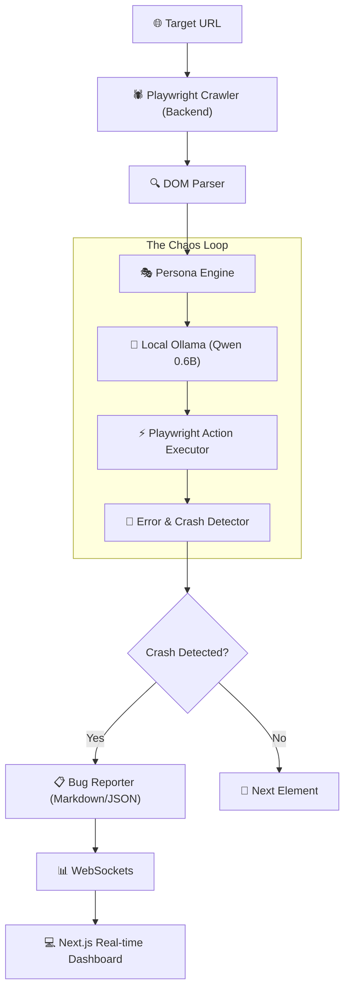

# 🏗️ SYSTEM ARCHITECTURE

## High-Level Architecture Diagram

## Component Breakdown

1. **Crawler & DOM Parser (`backend/core/crawler.py`)**
   - Headless Chromium intercepts the page.
   - Extracts all actionable nodes (inputs, buttons, textareas).
   - Strips visually hidden or disabled elements.

2. **Model Interface (`backend/core/model_client.py`)**
   - Connects to native Ollama API via REST.
   - Enforces fast timeouts to prevent hang-ups.

3. **Error Detector (`backend/core/error_detector.py`)**
   - Injects JS into the browser context to catch `window.onerror`.
   - Listens to HTTP Network responses (captures 500s).
   - Takes pre- and post-action screenshots.

4. **Frontend (`frontend/app/`)**
   - Receives data over WebSockets for ultra-low latency updates.
   - Computes the final Chaos Score client-side for immediate visual feedback.
